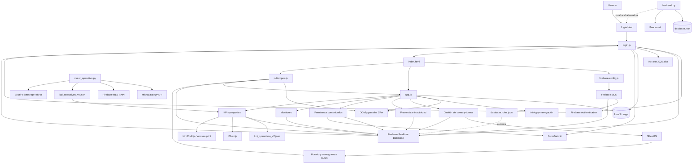

@@
# Arquitectura Actual (AS-IS)

## 1. Flujo de Datos General

Risk Manager opera actualmente como una aplicación web estática, sin framework ni paso de compilación, donde la mayor parte de la lógica de presentación, dominio e integración vive en `app.js`. Firebase Realtime Database y Firebase Authentication funcionan como servicios principales de identidad y persistencia; los archivos Excel y JSON públicos complementan los datos operativos; FormSubmit se usa para notificaciones por correo.

### Flujo de acceso y autenticación

1. El usuario abre `login.html`. La página carga las librerías CDN de SheetJS y Firebase, inicializa `firebase-config.js` y registra los handlers de `login.js`.
2. El usuario envía el formulario de inicio de sesión. `login.js` llama a Firebase Authentication con correo y contraseña.
3. Tras autenticarse, el código consulta el perfil del usuario en Realtime Database para obtener nombre, rol, aprobación, turno y estado.
4. Para los gestores, `checkShiftExpirationOnLogin()` descarga `Horario/Horario 2026.xlsx`, interpreta el bloque correspondiente al día actual y valida si el turno ya terminó.
5. Si el usuario puede entrar, la sesión y parte del perfil se serializan en `localStorage` bajo claves como `riskOps_currentUser`. La navegación cambia a `index.html`.
6. La autorización efectiva de lectura y escritura no depende solo de la interfaz: Firebase evalúa `database.rules.json` usando `auth.uid`, `approved` y `role`.

### Flujo de inicialización de la aplicación principal

1. `index.html` carga hojas de estilo, librerías CDN, Firebase SDK, `firebase-config.js`, `app.js` y finalmente `js/tiempos.js`.
2. `firebase-config.js` inicializa Firebase y, en localhost, intenta redirigir Auth y Realtime Database a los emuladores locales.
3. `app.js` comprueba la sesión en `localStorage`, inicializa variables globales y ejecuta `initApp()`.
4. `initApp()` configura navegación, perfil, presencia, sesiones activas, listeners de Firebase, controles de tareas, tema, bloqueo móvil y carga inicial de datos.
5. El estado de usuario se mantiene simultáneamente en memoria global (`currentUser` y referencias activas), `localStorage` y Firebase. No existe un store o contrato de estado centralizado.

### Flujo de tareas, horarios y archivos Excel

1. `loadSchedule()`, `loadExcelTasks()`, `loadTeletrabajo()` y funciones relacionadas solicitan archivos XLSX desde las carpetas públicas `Horario/`, `Cronograma de Tareas/`, `Teletrabajo/` y `Tareas Riesgo/`.
2. SheetJS convierte las hojas a matrices o estructuras JavaScript.
3. `app.js` interpreta fechas seriales, nombres, turnos, SETs y asignaciones mediante parsers y heurísticas locales.
4. Las tareas resultantes se cruzan con el usuario activo y se renderizan en el árbol de trabajo del DOM.
5. Los cambios de estado de las tareas se conservan en caché local y, cuando corresponde, se sincronizan con `active_sessions/{uid}/tasks` o con las rutas de progreso de Firebase.
6. El formato de las hojas y los IDs del HTML son dependencias directas del flujo; no hay un adaptador independiente que aísle el formato de origen.

### Flujo de operación durante el turno

1. El usuario interactúa con tareas, pausas, permisos y controles de sesión en `index.html`.
2. Los handlers de `app.js` actualizan el DOM, `shiftTimeline`, cachés locales y el estado de la sesión activa.
3. Los listeners de actividad, visibilidad, foco e Idle Detector actualizan el estado de presencia y pueden escribir `Activo` o `Inactivo` en Firebase.
4. Las solicitudes de permiso se escriben en `permissions/{id}` y pueden activar un formulario externo de notificación mediante FormSubmit.
5. Supervisores y administradores reciben datos a través de listeners o lecturas puntuales de Firebase y los renderizan directamente en tablas y paneles.

### Flujo de cierre de turno

1. `handleEndShift()` valida la sesión local, el SET seleccionado y las tareas pendientes.
2. Calcula pausas, inactividad, penalidades, horas efectivas y una bitácora consolidada desde `shiftTimeline`.
3. Construye el objeto `shift_reports` y realiza la persistencia atómica del reporte, el cierre de la sesión activa y el `logoutTime`.
4. Solo después de confirmar Firebase elimina datos de sesión y caché de `localStorage` y cierra Firebase Auth.
5. Finalmente intenta enviar un resumen a FormSubmit. El correo es una notificación secundaria y no revierte el cierre persistido.
6. La interfaz redirige al login. Si falla una fase intermedia, la función decide entre conservar la sesión, cerrar parcialmente o redirigir según la ruta de error.

### Flujo de indicadores y reportes

1. El panel operativo obtiene el histórico de `kpi_operativos_v2.json` mediante `fetch` y datos recientes de `shift_reports` y `users` desde Firebase.
2. `loadControlOperativoData()` fusiona ambas fuentes usando nombres normalizados, fechas y excepciones de compatibilidad.
3. `renderControlOperativoFiltered()` aplica filtros de gestor y periodo, agrega métricas y actualiza tarjetas, tablas y gráficas Chart.js.
4. `calcularIndicadores()` vuelve a consultar y procesar reportes para calcular actividades, conectividad, tardanza, inactividad y retiros, además de generar contenido HTML para detalles.
5. `js/tiempos.js` consulta `shift_reports` y `permissions`, reutiliza datos de horarios y calcula tardanza, inactividad y rankings propios.
6. Los reportes individuales se generan desde `exportShiftReport()` con `html2pdf.js`; el reporte ejecutivo se prepara en el DOM y usa `window.print()`.

### Flujo de automatización operativa externo

1. `motor_operativo.py` carga configuración desde variables de entorno y, al importar el módulo, consulta Firebase para construir el mapa de gestores aprobados.
2. `MicroStrategyConnector` autentica contra MicroStrategy, descubre el proyecto si es necesario y descarga el reporte de retiros mediante HTTP y paginación.
3. El conector aplana el árbol de respuesta, interpreta columnas posicionales, normaliza estados y filtra gestores.
4. `MotorOperativo` procesa los datos y los generadores Python producen archivos JSON que luego consume el frontend.
5. Este pipeline no comparte modelos tipados ni una API de dominio con `app.js`; la integración se realiza a través de archivos y convenciones de nombres.

### Backend local alternativo

1. `backend.py` puede servir archivos estáticos y exponer endpoints `/api/*` sobre un servidor HTTP local.
2. Lee y escribe `database.json` para usuarios y permisos, y lista documentos de `Procesos/`.
3. La autenticación del backend local comprueba únicamente la presencia de un valor después de `Bearer`; no valida el token contra Firebase.
4. Este backend está separado del flujo principal basado en Firebase y no constituye una capa de dominio compartida. Representa una ruta alternativa de laboratorio o compatibilidad.

## 2. Componentes Principales

| Componente | Responsabilidad actual | Dependencias principales | Grado de aislamiento |
|---|---|---|---|
| `login.html` + `login.css` | Entrada de autenticación, registro y recuperación de contraseña. | `login.js`, Firebase SDK, SheetJS, FormSubmit. | Bajo: IDs, formularios y handlers inline están acoplados al script. |
| `login.js` | Login, registro, recuperación, validación de turno y actualización visual de formularios. | Firebase Auth/RTDB, `Horario 2026.xlsx`, DOM, `localStorage`, FormSubmit. | Bajo: mezcla integración, reglas de negocio y presentación. |
| `index.html` + `styles.css` | Shell de la SPA, paneles por rol, formularios, tablas, contenedores de gráficas y modales. | IDs y clases consumidos directamente por `app.js` y `tiempos.js`. | Bajo: contrato implícito con JavaScript y estilos inline. |
| `app.js` | Núcleo monolítico del frontend: navegación, tareas, turnos, presencia, permisos, comunicados, monitoreo, KPIs y exportaciones. | DOM, Firebase, `localStorage`, XLSX, Chart.js, html2pdf, FormSubmit y estado global. | Muy bajo: concentra dominio, infraestructura, UI y ciclo de vida. |
| `js/tiempos.js` | Cálculo y visualización de tardanza, inactividad, rankings y matriz de tiempos. | `database`, `loadSchedule()`, variables globales y elementos del DOM. | Bajo-medio: está en otro archivo, pero depende de símbolos globales de `app.js`. |
| `firebase-config.js` | Inicialización de Firebase y conexión opcional con emuladores locales. | Firebase SDK, entorno del navegador y configuración del proyecto. | Medio: encapsula la inicialización, pero expone `database` globalmente. |
| Firebase Authentication | Identidad, sesión y cierre de sesión. | `login.js`, `app.js`, Firebase SDK y reglas. | Medio: servicio externo definido, pero invocado desde muchos handlers. |
| Firebase Realtime Database | Usuarios, sesiones, reportes, permisos, comunicados, logs, tareas y asignaciones. | Reglas RTDB, rutas literales en JavaScript y `firebase-config.js`. | Bajo-medio: centralizado como servicio, pero sin repositorios o modelos de acceso. |
| `database.rules.json` | Autorización real por UID, aprobación y rol en las rutas RTDB. | Estructura de datos y convenciones de roles/campos del frontend. | Medio: separado físicamente, pero acoplado al esquema y a nombres literales. |
| Archivos XLSX operativos | Horarios, cronogramas, teletrabajo y catálogos de tareas. | SheetJS, parsers de `app.js` y `login.js`, nombres y posiciones de columnas. | Bajo: formato externo consume directamente lógica de UI y negocio. |
| JSON de KPIs | Histórico de retiros y métricas precalculadas. | `fetch`, `loadControlOperativoData()`, `motor_operativo.py`. | Bajo-medio: intercambio por archivo sin contrato versionado. |
| FormSubmit | Notificaciones de registro, permisos y cierre de turno. | Formularios HTML, `fetch`, nombres de campos y destinatarios externos. | Bajo: la lógica de negocio construye directamente la petición externa. |
| `motor_operativo.py` y generadores Python | Extracción de MicroStrategy, transformación de retiros y generación de artefactos operativos. | MicroStrategy, Firebase REST, pandas, requests, Excel/JSON y variables de entorno. | Medio internamente, bajo respecto al frontend: usa modelos y contratos propios. |
| `backend.py` | Servidor HTTP local, archivos estáticos y API CRUD simple basada en JSON. | `database.json`, sistema de archivos y clientes HTTP locales. | Bajo: combina transporte, autorización, persistencia y routing en `APIHandler`. |
| Scripts `.bat` y workflows | Arranque local, construcción de documentos, actualización de datos y despliegue. | Python, Firebase CLI, archivos operativos y GitHub Actions. | Medio: automatizan procesos, pero dependen de rutas y herramientas instaladas. |

En conjunto, los únicos límites físicos claros son los archivos y servicios externos. Los límites de responsabilidad son débiles: `app.js` y `login.js` cruzan presentación, reglas de negocio, persistencia y comunicación externa; `tiempos.js` ofrece una separación parcial, pero continúa dependiendo de variables y funciones globales.

## 3. Diagrama de Módulos (Texto / PlantUML / Mermaid)

### Lectura del diagrama

- La ruta principal de usuario es `login.html` -> `login.js` -> Firebase -> `index.html` -> `app.js`.
- `app.js` es el concentrador actual: recibe eventos del DOM, consulta Firebase y archivos, modifica `localStorage`, calcula reglas de negocio y vuelve a renderizar la interfaz.
- `js/tiempos.js` es un módulo separado físicamente, pero sus flechas hacia `app.js` y los archivos de horarios representan su dependencia de funciones y variables globales.
- `motor_operativo.py` alimenta el frontend por archivos JSON, no por un contrato de servicio compartido.
- `backend.py` no aparece como backend principal de producción; es una ruta local alternativa con almacenamiento JSON propio.
- `database.rules.json` no es llamado por JavaScript, pero Firebase lo aplica como frontera efectiva de autorización para las operaciones RTDB.

## 4. Mecanismo de Carga, Compilación y Entornos (AS-IS)

> Sección añadida el 2026-09-23. Describe cómo se ejecuta hoy el frontend (commit `04ee93d`), para contrastarlo con la estrategia objetivo de `propuesta-modular.md` §4.1 (bundle esbuild).

### 4.1 Carga de código en el navegador

**No hay bundler, ni módulos ES, ni paso de compilación.** Todo el código propio son scripts clásicos que comparten el ámbito global (`window`). No existe `package.json` en la raíz.

| Página | Orden de carga (síncrono, bloqueante) |
|---|---|
| `index.html` | Estilos (Google Fonts, boxicons, `styles.css`) → librerías CDN en `<head>` (SheetJS `xlsx-0.20.0`, jsPDF, html2pdf, Chart.js y su plugin de datalabels) → Firebase SDK `8.10.1` (`firebase-app`, `firebase-auth`, `firebase-database`) → `firebase-config.js` → `app.js` → `js/tiempos.js` |
| `login.html` | SheetJS → Firebase SDK `8.10.1` → `firebase-config.js` → `login.js` |

Consecuencias que el plan de migración debe respetar:

- Los símbolos compartidos son globales implícitos: `firebase`, `database` (definido por `firebase-config.js`), `XLSX`, `Chart`, y todas las funciones y variables de `app.js`, de las que depende `js/tiempos.js`.
- El HTML invoca funciones por atributos inline (`onclick="funcion(...)"`), por lo que dependen de estar en `window`.
- Como los scripts son bloqueantes, `app.js` se ejecuta por completo (incluidos sus listeners y `setInterval` de presencia e inactividad) antes de que `js/tiempos.js` empiece. Es un orden que la estrategia de bundle debe conservar.
- El control de caché es manual, con parámetros de versión escritos a mano en cada `<script>`/`<link>` (`app.js?v=20260826_v1`, `js/tiempos.js?v=20260730_v3`, etc.).

### 4.2 Publicación (producción)

No hay compilación: `deploy-pages.yml` **copia** a `_site/` una allowlist explícita de archivos fuente (`index.html`, `login.html`, `app.js`, `login.js`, `styles.css`, `login.css`, `firebase-config.js`, `CNAME`, `.nojekyll`, dos JSON, `js/`, `assets/`, los XLSX operativos aprobados), valida que no haya archivos privados o no autorizados (`.github` está prohibido) y publica en GitHub Pages solo desde `main`. En PR se ejecuta la validación pero no se publica.

### 4.3 Entorno local ("Laboratorio Local")

- `firebase-config.js` detecta `localhost`/`127.0.0.1` y redirige Auth a `127.0.0.1:9099` y Realtime Database a `127.0.0.1:9000`; en cualquier otro host usa el proyecto real.
- `Iniciar_Laboratorio_Local.bat` ejecuta `npx firebase-tools emulators:start --only hosting,auth,database,ui --import=./emulator_data --export-on-exit`. Hosting sirve la raíz del repositorio (`"public": "."` con la lista `ignore` de `firebase.json`, que excluye rutas con punto, por ejemplo `.github/`); la UI queda en `:4000` y la app en `:5000`.
- El emulador de Realtime Database corre sobre JVM (Java); en esta máquina falla con JDK 21 (ver memoria del proyecto), de modo que el laboratorio completo no arranca hasta resolverlo.
- Alternativa heredada: `backend.py` (servidor HTTP local con API sobre `database.json`), fuera del flujo Firebase principal.

### 4.4 Estado de transición

El objetivo (`propuesta-modular.md` §4.1, decisión del 2026-09-23) es añadir **un único paso de compilación con esbuild** que empaquete `src/` en `riskops.bundle.js` (script clásico IIFE, global `RiskOps`), cargado antes de `app.js`. Hasta que los cortes del paso 9 de la Fase 1 y de la Fase 3 se aprueben y apliquen, lo descrito en 4.1–4.3 sigue siendo la realidad de producción.
*** End Patch
